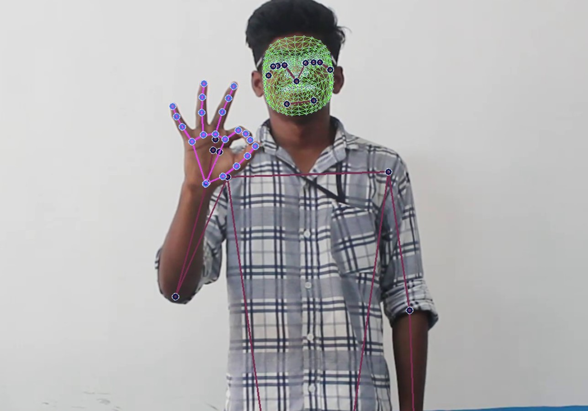

# Real-Time-ISL-Translation

## ***Introduction***

Indian Sign Language is not only a means of communication for the hearing impaired, but is a symbol of pride and idendity.
Strenuous efforts have been made by Deaf communities, NGO's, researchers and other organisations working for people with hearing disabilities , including the All India Federation of Deaf (AIFD), National association of the Deaf (NAD) in the direction of encouraging ISL.

There has been some significant amount of research on Sign language translation, but with very less focus for Indo sign language.

This project presents a system which can recognise gestures from the Indian Sign Language (ISL) using ***Mediapipe Pose Detection Library*** and the feeding the data points through an ***LSTM Network***, enabling real-time prediction of the language. This attempts to bridge the communication gap between the hearing and speech impaired and the rest of the society.

## ***Architecture***

<ul>
  <li>Feed the video sequence to MediaPipe Pose Detection Library.</li>
  <li>Extract Arms and Body Posture keypoints.</li>
  <li>Feed the sequence data into an LSTM Network.</li>
  <li>Predict classes of gestures.</li>
</ul>

## ***Dataset***

The dataset used is: ***INCLUDE: A Large Scale Dataset for Indian Sign Language Recognition***

The INCLUDE dataset has 4292 videos (the paper mentions 4287 videos but 5 videos were added later). The videos used for training are mentioned in train.csv (3475), while that used for testing is mentioned in test.csv (817 files). Each video is a recording of 1 ISL sign, signed by deaf students from St. Louis School for the Deaf, Adyar, Chennai

For other details: [INCLUDE: A Large Scale Dataset for Indian Sign Language Recognition](https://zenodo.org/record/4010759)

We have used a small subset of the dataset, namely [Greetings_1of2.zip](https://zenodo.org/record/4010759/files/Greetings_1of2.zip?download=1) and	[Greetings_2of2.zip](https://zenodo.org/record/4010759/files/Greetings_2of2.zip?download=1). This needs to be downloaded and clubbed into the same directory, with a folder name "greetings_data".

## ***Modules***

<ul>
  <li>main.py: Runs the model on a Local Video file or WebCam</li>
  <li>models.py: Contains several model architectures.</li>
  <li>utils.py: Contains various utility functions.</li>
  <li>keypoint_extraction.py: Extracts pose keypoints and saves locally.</li>
  <li>train.py: Contains training loops.</li>
  <li>evaluate.py: Contains metrics for model evaluation.</li>
</ul>

## ***Additional Information***

Since the training has been performed on a relatively small subset of the dataset, perfomance is not highly accurate. However with enough computational resources, it can be scaled to include entire training dataset, to produce credible results.

